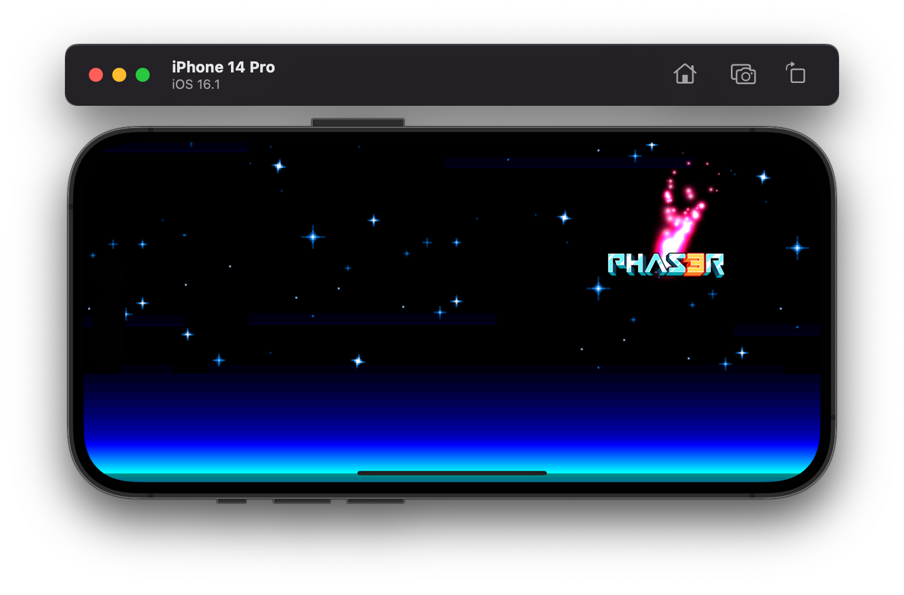

## Capacitor + Phaser

Use this starter to build mobile games using Capacitor and [Phaser](https://phaser.io).  This starter uses [Vite](https://vitejs.dev/) with TypeScript which is a great stack for building apps.

Capacitor and Phaser form the basis of such popular games as [Vampire Survivors](https://store.steampowered.com/app/1794680/Vampire_Survivors/) 🧛‍♂️.

